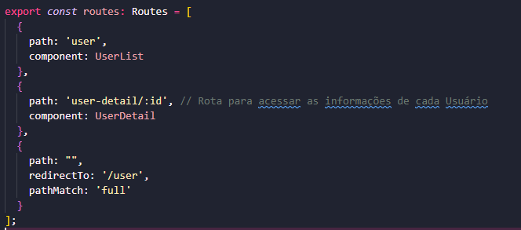
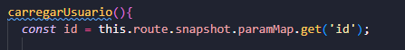
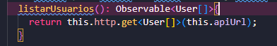
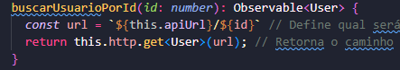
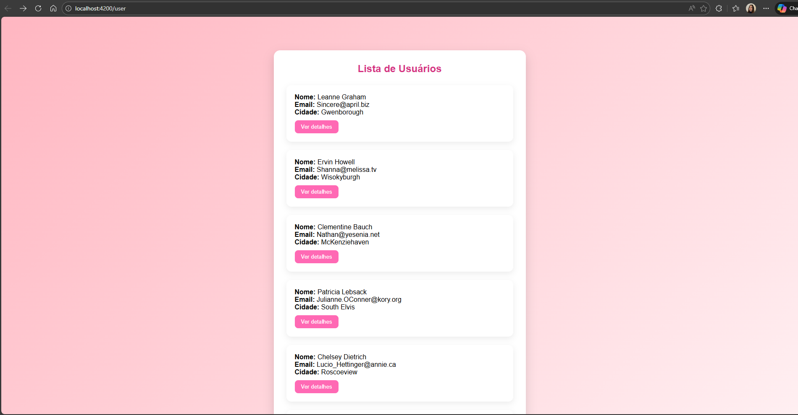
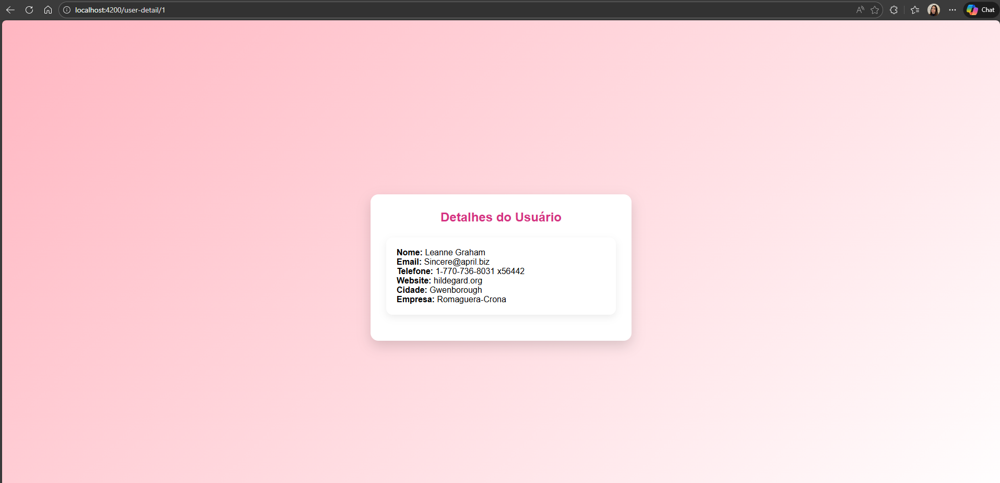

# Atividade Guiada - Angular + API Pública + Rotas Dinâmicas
# Ana Julya Borges - DTA 2026

✅ O que é rota dinâmica?

É uma rota que muda de acordo com um parâmetro, como um id.

O que muda é o id.
Esse ":id" é o parâmetro dinâmico da rota.

✅ O que é ParamMap?

O ParamMap é um recurso do Angular que serve para pegar os parâmetros da rota.

O Angular guarda o parâmetro, como no exemplo ele irá guardar o valor do id.

- paramMap → acessa os parâmetros da rota

- get('id') → pega o valor do parâmetro chamado id

✅ Onde foi usado o Observable e por quê.

Foi utilizado no retorno de duas funções do service

e

Por que o Observable foi utilizado?

O Observable serve para que o Angular espere a resposta da API e entregue os dados quando eles estiverem prontos.

Depois, no componente, usamos subscribe() para receber esses dados e mostrar na tela.

Prints das Telas:

